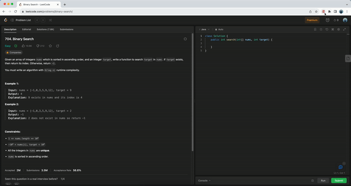

# Leetcode Assistant Chrome Extension

The LeetCode Assistant Chrome Extension enhances your experience on the LeetCode website by providing convenient tools to manage and track your problem-solving journey.

This extension makes use of [Algonotebook](https://github.com/buikhacnam/algo-notebook)



## Installation

Download the extension in [Chrome Web Store]('https://chrome.google.com/webstore/detail/leetcode-assistant/nbeehcepchjjlajedbfbjcfdmgcoioja') page: 

https://chrome.google.com/webstore/detail/leetcode-assistant/nbeehcepchjjlajedbfbjcfdmgcoioja

## Features

- Automatically generates a "View Solution" link for LeetCode problems, allowing you to quickly access solutions in different languages.
- Saves visited LeetCode problem links for easy access and reference.
- Opens solution links in popup windows for a distraction-free reading experience.
- User-friendly interface for easy navigation and interaction.

## Run Locally

1. Clone the repository:

   ```bash
   git clone https://github.com/yourusername/leetcode-assistant-chrome-extension.git
    ```
2. Open the Extension Management page by navigating to `chrome://extensions`.
3. Enable Developer Mode by clicking the toggle switch next to **Developer mode**.
4. Click the **LOAD UNPACKED** button and select the extension directory.
    
## License

This project is licensed under the MIT License. See the [LICENSE](LICENSE) file for details.
